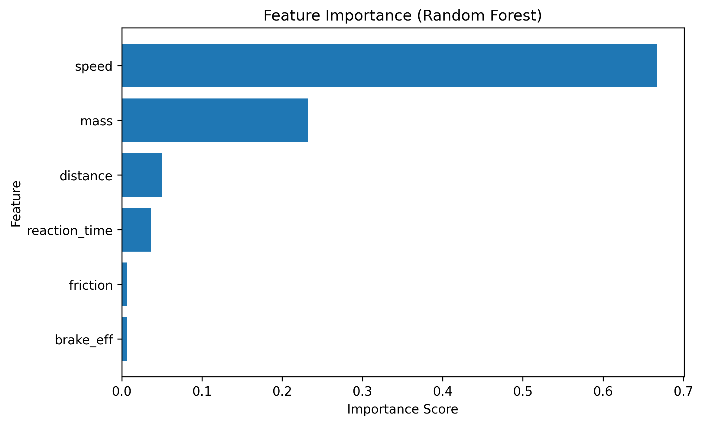
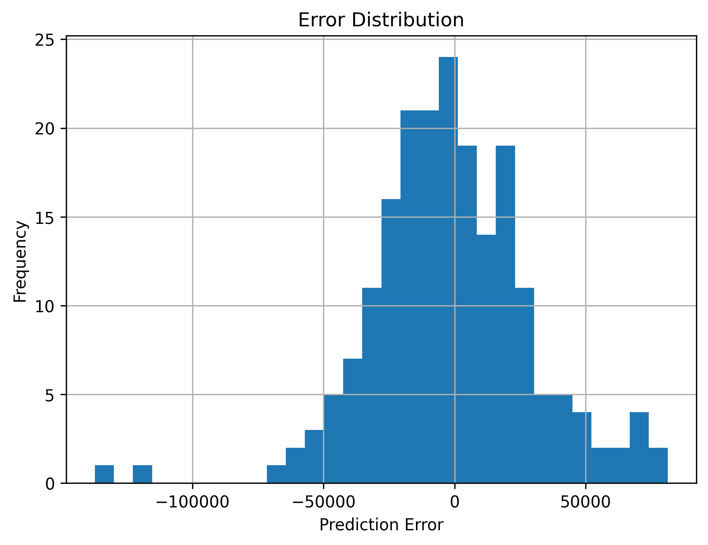
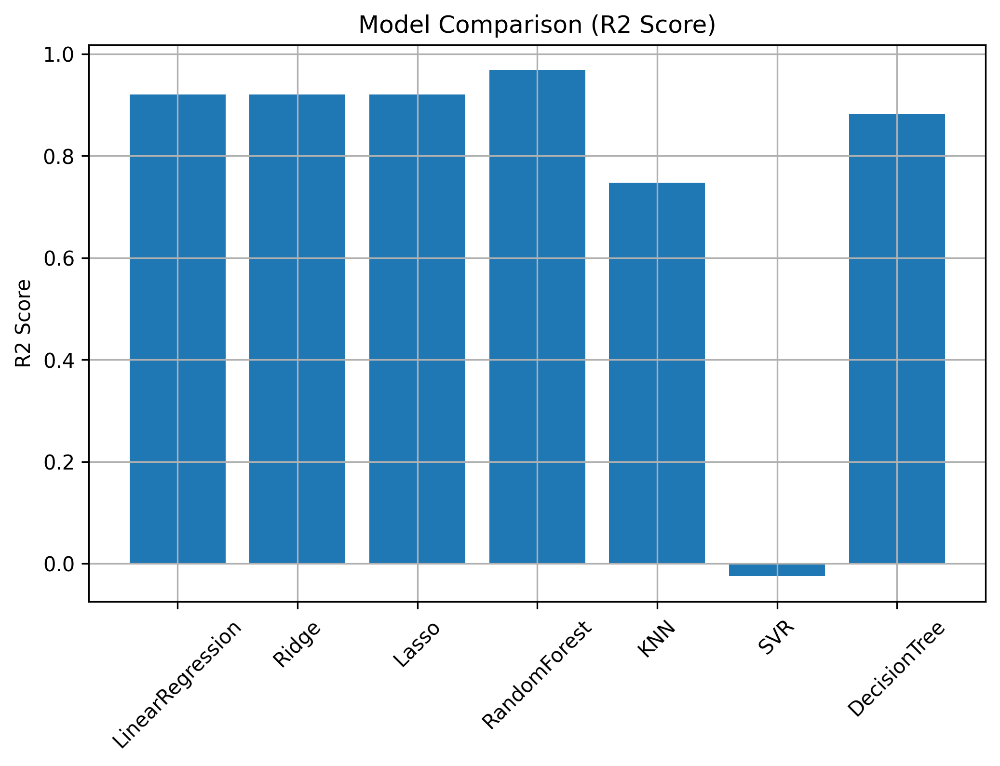

# 🚗 Simulation-Based Car Crash Data Generation for Machine Learning

## 📌 Assignment: Data Generation using Modelling and Simulation for Machine Learning

---

## 1. Introduction

In many real-world scenarios, collecting data is difficult, expensive, or dangerous. One such example is **car crash data**, where real experiments are unsafe, costly, and ethically problematic. Therefore, **simulation-based data generation** is widely used in engineering and machine learning research.

In this project, a **simulation-based car braking and collision model** is used to generate synthetic data, which is then used to train and evaluate multiple machine learning models.

---

## 2. Simulation Tool Used

**SimPy (Simulation in Python)**

- SimPy is an open-source discrete-event simulation library in Python.
- It is used to model time-based processes such as reaction delay and braking events.
- It is suitable for modeling real-world systems like traffic and vehicle interactions.

---

## 3. Problem Description

We simulate a **two-car scenario**:

- The front car suddenly brakes.
- The rear car reacts after some reaction time.
- Depending on speed, distance, braking efficiency, and road friction:
  - Either the car stops safely
  - Or a collision occurs and an **impact force** is produced.

This simulation is repeated many times with random parameters to generate a dataset.

---

## 4. Input Parameters and Ranges

| Parameter | Description | Range |
|----------|-------------|--------|
| speed | Vehicle speed (m/s) | 10 – 40 |
| distance | Distance between cars (m) | 5 – 50 |
| reaction_time | Driver reaction time (s) | 0.5 – 2.5 |
| brake_eff | Braking efficiency | 0.5 – 1.0 |
| friction | Road friction coefficient | 0.3 – 0.9 |
| mass | Vehicle mass (kg) | 800 – 2000 |

### Output (Target Variable):

- **impact_force** (0 if no collision)

---

## 5. Data Generation Process

- Random values are generated for all input parameters.
- These values are passed to the simulation model.
- The simulation computes whether a crash occurs and calculates the impact force.
- This process is repeated **1000 times**.
- The generated dataset is saved as:


---

## 6. Machine Learning Models Used

The following models were trained and compared:

- Linear Regression
- Ridge Regression
- Lasso Regression
- Random Forest Regressor
- K-Nearest Neighbors (KNN)
- Support Vector Regressor (SVR)
- Decision Tree Regressor

---

## 7. Evaluation Metrics

Each model is evaluated using:

- **R² Score** (Goodness of fit)
- **RMSE** (Root Mean Squared Error)
- **MAE** (Mean Absolute Error)

---

## 8. Results

### 📊 Model Comparison Table

| Model | R² | RMSE | MAE |
|------|----|------|------|
| RandomForest | **0.9686** | **31271** | **23775** |
| LinearRegression | 0.9206 | 49735 | 36246 |
| Lasso | 0.9206 | 49736 | 36246 |
| Ridge | 0.9205 | 49738 | 36247 |
| DecisionTree | 0.8819 | 60654 | 44694 |
| KNN | 0.7473 | 88706 | 66619 |
| SVR | -0.0246 | 178625 | 147432 |

---

## 9. Result Visualizations

### 🔹 Actual vs Predicted (Best Model)


### 🔹 Feature Importance



### 🔹 Error Distribution



### 🔹 Model Comparison



---

## 10. Best Model

> ✅ **Random Forest Regressor** performed the best with:
- Highest R² score
- Lowest RMSE
- Lowest MAE

This indicates that the dataset has **non-linear relationships**, which Random Forest models very well.

---

## 11. Conclusion

This project demonstrates that **simulation-based data generation** is an effective approach when real-world data is difficult, dangerous, or expensive to collect. The generated synthetic data was successfully used to train multiple machine learning models, and Random Forest achieved the best performance.

---

## 12. Repository Structure

```
simulation-based-ml-car-crash/
├── data/
│   └── crash_simulation_data.csv
├── notebook/
│   └── crash_simulation_and_ml.ipynb
├── results/
│   ├── actual_vs_predicted.png
│   ├── feature_importance.png
│   ├── error_distribution.png
│   └── model_comparison.png
└── README.md
```

## 13. How to Run

1. Open the notebook in Google Colab or Jupyter Notebook.
2. Install dependencies:
   pip install simpy numpy pandas scikit-learn matplotlib
3. Run all cells to:
   - Generate data
   - Train models
   - Produce results and plots
  
## 📌 Author

Harshit Katyal
